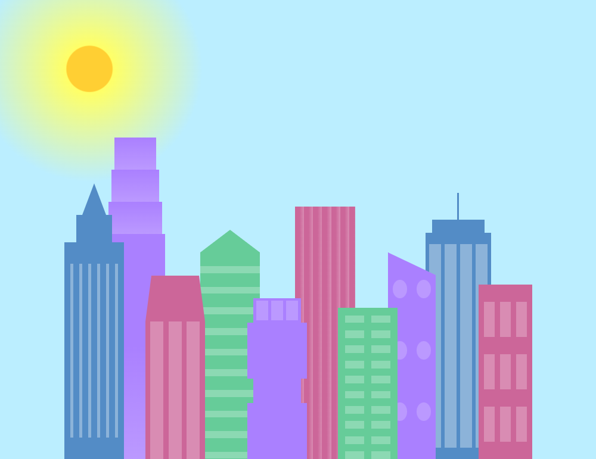
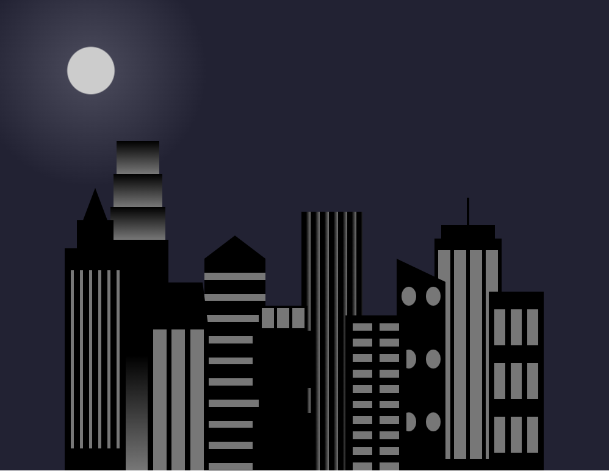

# City Skyline

A dynamic, responsive city skyline that adapts to screen size. On wide screens, it showcases a vibrant daytime cityscape with a shining sun. Resize your screen to below 1,000 pixels to see the scene shift into a serene night sky.

## Built with

- HTML
- CSS

## What I learned by building this project?

Working on this project significantly enhanced my CSS skills. Before this, I never imagined creating buildings and windows using only CSS and linear gradients or shaping structures with the border property. The end result is so polished that it looks more like artwork than code. I also deepened my understanding of background properties, such as repeating linear gradients and the use of percentages for precise control.

## My favorite part of this project?

My favorite aspect of this project was using @media rules to make the skyline responsive, seamlessly transitioning from a vibrant daytime scene to a tranquil nightscape on screens smaller than 1,000 pixels.

    Check out the city skyline <a href="https://ceceliabraswell.github.io/city-skyline/">here</a>!

